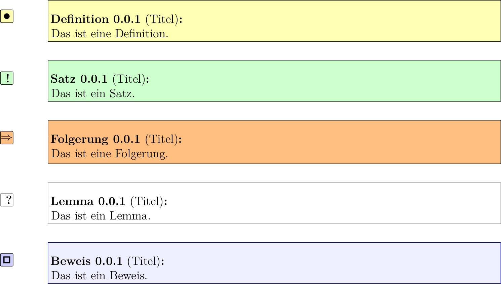

# mathenv

Latex-Paket mit Umgebungen für Definitionen, Sätze, Folgerungen, Lemmata und Beweise.

## Installation

Die Datei ```mathenv.sty``` nach ```$TEXMFHOME/tex/latex/mathenv/mathenv.sty``` kopieren. Standardmäßig ist ```$TEXMFHOME``` ```~/texmf```.


## Benutzung

* Einbinden mit ```\usepackage{mathenv}```
* Umgebungen mit ```\begin{NAME}[TITEL] ... \end{NAME}``` erstellen. Verfügbar sind: ```definition```, ```satz```, ```folgerung```, ```lemma``` und ```beweis```
* Referenzierung mit: ```\refdefinition```, ```\refsatz```, ```\reffolgerung```, ```\reflemma```, ```\refbeweis```


## Preview

